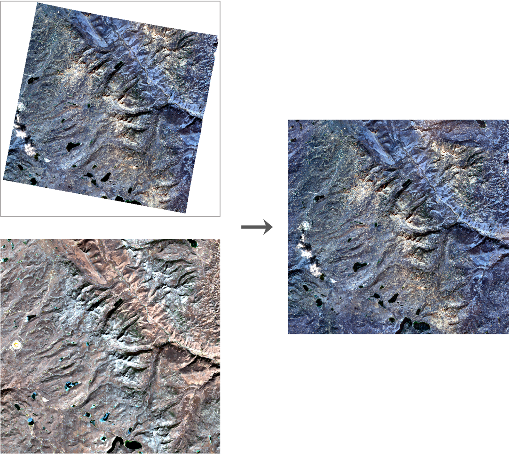

# Extend-GAN

This work can be used to extend the boundaries of a high-resolution image to the extent of a given low-resolution reference image:



## Environment

Tested on Ubuntu 20.04. Python version 3.10. Pytorch version 1.13.1.

Create your environment using this command:

```bash
mamba env create -f environment_1.13.1.yaml
```

If you use `conda`, replace `mamba` with `conda`.

## Dataset

Prepare your data and use `util/crop_rs.py` to crop HR and corresponding LR images.

You will get folders following this structure:

```bash
dataset
├─train
│  ├─source
│  │      source1.tif
│  │      source2.tif
│  │      ...
│  │
│  ├─ref
│  │      ref1.tif
│  │      ref2.tif
│  ├...
│  
└─test
   ├─source
   │      source1.tif
   │      source2.tif
   │      ...
   │
   ├─ref
   │      ref1.tif
   │      ref2.tif
   └─...
```

Generate flists in current directory.

```bash
ls -R ${YOUR_ABSOLUTE_PATH} > ${FLIST_NAME}
# for example
ls -R /data/cyc/dataset/train/source/*.tif > train.flist
ls -R /data/cyc/dataset/test/source/*.tif > test.flist
```

The default size is `512`, use `util/crop_256.ipynb` to randomly crop images, if necessary.

## Train

```bash
python train.py --batch_size ${BATCH_SIZE} --train_dataset_name ${YOUR_TRAIN_FLIST} --n_epochs ${TOTAL_EPOCHS}
# for example
python train.py --batch_size 8 --train_dataset_name /data/cyc/dataset/train.flist --n_epochs 2400 > log_42.txt 
```

## Test

```bash
python test.py --image_path ${YOUR_TEST_FLIST} --model ${YOUR_GENERATOR_PATH}
# for example
python test.py --image_path /data/cyc/dataset/test.flist --model saved_models/generator_2400.pth
```

## Acknowledgments

We are benefiting a lot from the following projects:

- [Image-Inpainting-Implementations](https://github.com/xyfJASON/Image-Inpainting-Implementations)

- [Boundless-in-Pytorch](https://github.com/recong/Boundless-in-Pytorch)

- [Palette-Image-to-Image-Diffusion-Models](https://github.com/Janspiry/Palette-Image-to-Image-Diffusion-Models)
